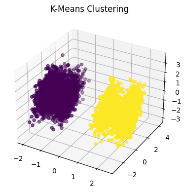
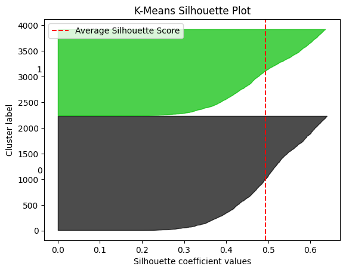

# Sentiment Analysis and Customer Segmentation Project

## Overview
This project involves analyzing customer shopping trends using a dataset from Kaggle, providing insights through SQL analysis, visualizations, and creating a dashboard in Power BI. Additionally, machine learning models such as K-Means, PAM, and CLARANS are employed for customer segmentation. The goal of this project is to analyze customer shopping trends and segment customers to enhance marketing strategies and improve sales through data-driven insights.

## Table of Contents
1. [Data Collection](#data-collection)
2. [Exploratory Data Analysis](#exploratory-data-analysis)
3. [Modeling](#modeling)
4. [Application](#application)
5. [Conclusion and Recommendations](#conclusion-and-recommendations)

## Data Collection
The dataset used is "Customer Shopping Trends" from Kaggle, which includes various attributes such as age, gender, purchase history, and location.

## Exploratory Data Analysis
Performed using SQL queries and visualized with Power BI. Key insights include:
- Age distribution.
- Gender composition.
- Purchase patterns.
- Spending habits.
- Location preferences.
- Top categories, items

## Modeling
Applied clustering algorithms:
- **K-Means**
- **PAM**
- **CLARANS**

### By implementing these strategies, the store can enhance customer satisfaction, loyalty, and profitability.
#### Some Data Analysis Results

Distribution of age:
| Age | Purchase Amount |
|-----|-----------------|
| 69  | 88              |
| 57  | 87              |
| 41  | 86              |
| 25  | 85              |
| 49  | 84              |
| 50  | 83              |
| 27  | 83              |
| 62  | 83              |
| 54  | 83              |
| 32  | 82              |
| 58  | 81              |
| 19  | 81              |
| 42  | 80              |
| 28  | 79              |
| 43  | 79              |
| 31  | 79              |
| 37  | 77              |
| 46  | 76              |
| 29  | 76              |
| 59  | 75              |

Average Purchase Amount by Gender:
| Gender | Average Purchase Amount |
|--------|-------------------------|
| Male   | 59.5362                 |
| Female | 60.2492                 |

Seasonality in Purchase Frequency:
| Season | Frequency        | Purchase Amount |
|--------|------------------|-----------------|
| Fall   | Annually         | 157             |
| Fall   | Bi-Weekly        | 120             |
| Fall   | Every 3 Months   | 147             |
| Fall   | Fortnightly      | 143             |
| Fall   | Monthly          | 137             |
| Fall   | Quarterly        | 143             |
| Fall   | Weekly           | 128             |
| Spring | Annually         | 137             |
| Spring | Bi-Weekly        | 155             |
| Spring | Every 3 Months   | 146             |
| Spring | Fortnightly      | 133             |
| Spring | Monthly          | 144             |
| Spring | Quarterly        | 142             |
| Spring | Weekly           | 142             |
| Summer | Annually         | 143             |
| Summer | Bi-Weekly        | 132             |
| Summer | Every 3 Months   | 152             |
| Summer | Fortnightly      | 127             |
| Summer | Monthly          | 133             |
| Summer | Quarterly        | 144             |
| Summer | Weekly           | 124             |
| Winter | Annually         | 135             |
| Winter | Bi-Weekly        | 140             |
| Winter | Every 3 Months   | 139             |
| Winter | Fortnightly      | 139             |
| Winter | Monthly          | 139             |
| Winter | Quarterly        | 134             |
| Winter | Weekly           | 145             |

Top popular sizes and colors:
| Size | Color     | Count |
|------|-----------|-------|
| M    | Violet    | 87    |
| M    | Olive     | 86    |
| M    | Silver    | 79    |
| M    | Gray      | 78    |
| M    | Charcoal  | 77    |
| M    | Maroon    | 76    |
| M    | Orange    | 74    |
| M    | Indigo    | 73    |
| M    | White     | 71    |
| M    | Magenta   | 71    |
| M    | Peach     | 70    |
| M    | Green     | 70    |
| M    | Teal      | 70    |
| M    | Black     | 68    |
| M    | Beige     | 67    |
| M    | Gold      | 66    |
| M    | Lavender  | 65    |
| M    | Red       | 65    |
| M    | Cyan      | 65    |
| M    | Brown     | 65    |

Most common shipping type:
| Shipping Type | Count |
|---------------|-------|
| Free Shipping | 675   |
| Standard      | 654   |
| Store Pickup  | 650   |
| Next Day Air  | 648   |
| Express       | 646   |
| 2-Day Shipping| 627   |

Impact of Promo Codes on Purchases:
| Promo Code Used | Purchase Count | Percentage |
|-----------------|----------------|------------|
| Yes             | 1677           | 43%        |
| No              | 2223           | 57%        |

## Conclusion and Recommendations
### Conclusion
This project provides valuable insights into customer shopping trends through data analysis, visualization, and segmentation. The results help in understanding customer behavior and can guide business decisions to improve customer engagement and sales strategies. The cluster analysis revealed that both clusters have similar age distributions, purchase patterns, and spending habits, but differ slightly in gender composition and shopping locations.

### Recommendations
1. **Age-Based Strategies**: No age-specific adjustments needed.
2. **Gender-Based Strategies**: 
   - Cluster 0: Target female customers with special promotions.
   - Cluster 1: Broader focus on mixed-gender products.
3. **Purchase Patterns**: Continue offering diverse products.
4. **Spending Habits**: Maintain current pricing strategy.
5. **Location-Based Strategies**:
   - Cluster 0: Expand presence in diverse shopping locations.
   - Cluster 1: Maintain strong presence in key locations.

## Future Work
- Enhance the machine learning models with more advanced techniques and fine-tuning.
- Incorporate additional data sources for a more comprehensive analysis.
- Extend the dashboard with more interactive features and deeper insights.

## Acknowledgements
- The dataset used in this project is sourced from [Kaggle]([https://www.kaggle.com](https://www.kaggle.com/datasets/iamsouravbanerjee/customer-shopping-trends-dataset)/).
- Special thanks to the developers and contributors of the libraries and tools used in this project: SQL, Power BI, Python, scikit-learn and pyclustering.
